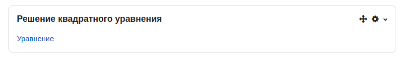
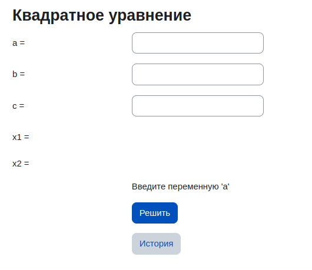
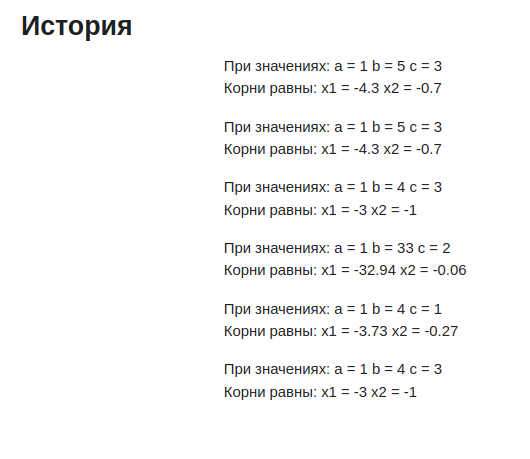

 <h1 align="center"> «Блок» для решения квадратного уравнения</h1>
  <p> Этот проект реализован с помощью PHP 7.4.33 , Moodle 4.0.5+ (Build: 20221222), PostgreSql и Nginx.
 <h2>Описание:</h2>
  <p> На основе вводимых пользователем значений a, b, c – плагин выдает найденные значения x1 и x2. </p>

<h2>Функционал сервиса:</h2>
<ul>

- Найти значения x1 и x2
- Данные записываются в базу данных
- Просмотр истории вводимых данных и найденных решений, на отдельной странице
- Реализована проверка ввода значении a, b и c:
    - Переменная a не должна быть пустой
    - Переменная a не должна равна 0
    - Переменные a, b и c должны быть числами
</ul>

<h2>Форма блока:</h2>
<ul>

- При добавлении блока quadratic_equation появится форма "Уравнение", нажмите на нее чтобы откыть форму



- Форма уравнения



- История



</ul>

<h2>Чтобы запустить проект, выполните:</h2>

1. Поднять проект:

```make dev-up```

2. Документация API:

```http://localhost:8000/api/documentation#/```

